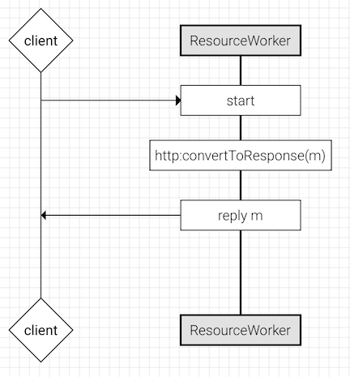

# Workers

A worker is a thread of execution. It is represented on a sequence diagram as a vertical "lifeline" of logic to be executed. 



When you create a [resource](resources.md), [function](functions.md), or [action](actions.md), a default worker is created automatically that performs the logic for that entity. You can add more workers to a resource or function, giving each worker its own logic to execute. This approach allows you to program parallel threads of execution. You can also use the [fork/join](statements.md#forkjoin) statement to easily create a set of workers and have them process in parallel.

Workers do not share any state with each other. Upon invocation, the “parent” worker can pass a message to the new worker. Resource workers can also access the service's state.

## Adding a worker

To add a worker in Design View in the Composer, drag the Worker icon from the tool palette to your sequence diagram:


To add a worker when working directly with the source code of your program, a worker is defined and declared as follows:

```
worker WorkerName (message m) {
    Statement;+
    [reply MessageName;]
}
```

If the [Reply](statements.md#reply) statement is present, it must be at the end of the worker. The reply indicates what message will be returned to the initiator if the initiator requires a response from the worker. If no Reply statement is present, it has the same effect as having sent a null message.

## Initiating the worker

Workers initially come into existence when the enclosing entity-- a [resource](resources.md), [function](functions.md), or [action](actions.md)--becomes active. However, similar to a resource, the worker does not execute until it has been sent a message.

A worker is triggered when a message is sent to the worker as follows by the enclosing entity:
```
MessageName -> WorkerName;
```

## Replying from a worker

The worker can reply to the enclosing entity using a [Reply](statements.md#reply) statement. When the worker replies, the response message (if any) is received by the enclosing entity from the worker as follows:
```
MessageName <- WorkerName;
```

If the worker does not reply, the enclosing entity will wait until the named worker completes and return a null value for the message.

If there is no wait for completion of a particular worker, and if the enclosing entity finishes execution, all active workers are immediately killed prior to returning from the enclosing context. 
